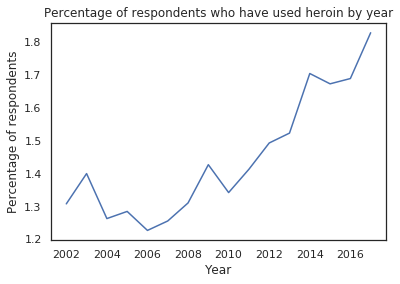
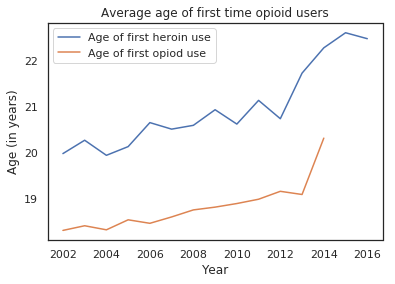
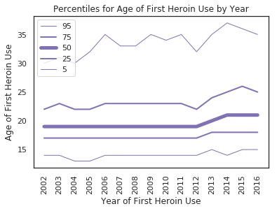
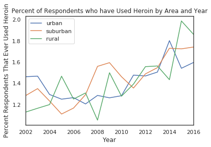
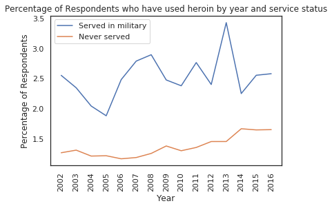
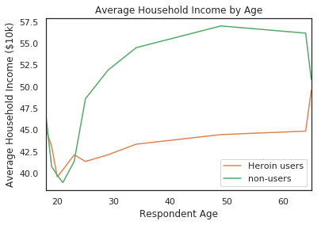
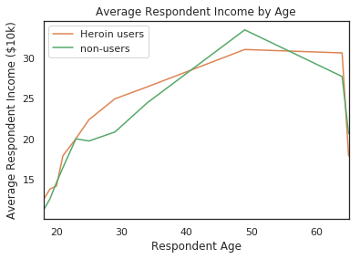
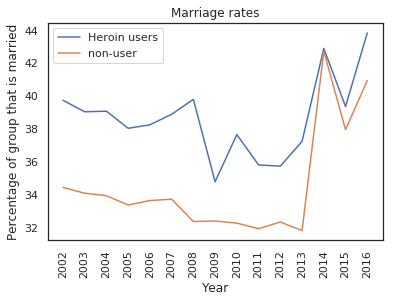
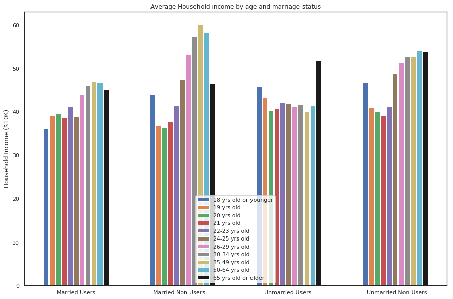

# The Opioid Epidemic & Its Socioeconomic Effects
### By Daniel Connolly & Bryce Mann

We sought to investigate how the use of opioids, and specifically heroin, has changed over the last two decades as well as to look into various differences between people who have used opioids and the people who do not. The increasing use of opioids in the US is regularly referred to as a crisis or epidemic, so we employed data from the National Survey on Drug Use and Health (NSDUH) to explore the existence and severity of this crisis. To comply with the NSDUH guidelines, we will not share the raw data, but will instead share our findings in the form of various statistics we compute and plots we visualize. Although we explored a great deal of relationships between opioid use and other socioeconomic and demographic factors, we present here only the most interesting and meaningful of the relationships we found. For more details, you can read [this Jupyter notebook](https://github.com/djconnolly27/DataScienceProject1/blob/master/project1/project1_updated.ipynb).

## Experiment 1: Characterizing the Epidemic

While it is often assumed that opioid use has reached epidemic levels, we first tested this idea for ourselves. To do so, we computed the percentage of respondents who had ever used heroin over time and plotted the results.

As we can see, the percentage of respondents who say that they have used heroin has increased by approximately 0.5 percentage points between 2002 and 2016, an effect size of **+40%**. If we were to assume the respondents perfectly represent the 325 million people in the US, this increase would mean that 1.625 million more people used heroin as of 2016 as compared to 2002. According to the CDC, an “epidemic refers to an increase, often sudden, in the number of cases of a disease above what is normally expected in that population in that area.” Over the course of 14 years, an increase of 1.625 million people would seem to confirm that heroin use has reached epidemic levels.

To further confirm that the increase in the use of opioids is not simply a function of drug usage as a whole increasing, we also looked into the use of crack, LSD, and painkillers for non-medical purposes. From 2002 to 2016, crack use declined by **-13%** and LSD use declined by **-23%**. Additionally, the nonmedical use of pain relievers declined by **-6%**. The plots displaying these changes are in our [Jupyter notebook](https://github.com/djconnolly27/DataScienceProject1/blob/master/project1/project1_updated.ipynb). Because the utilization of these other drugs and painkillers has declined, as these effect sizes indicate, the epidemic seems to be unique to heroin and perhaps other similar drugs not included in the NSDUH under the umbrella of pain relievers.

Next, we wanted to understand when in people’s lifetimes they began to use opioids. Popular conception of the opioid epidemic led us to hypothesize that the average age at which people began using heroin and painkillers would increase. As a result, we plotted this average start age in each year in which survey data was collected.

Between 2002 and 2016, the average age at which people first used heroin increased by 2.5 years, and the average age at which people started using painkillers increased by 2 years. To break down this trend even more, we looked at five percentile groups for the starting age of heroin users.

The highest percentile groups, representing the oldest ages at which people start heroin, have increased the most. This indicates that our notion that the increase in heroin use is due to so-called “late-starters” is correct, which is consistent with the common narrative that opioids have begun to impact older people through new and different pathways.

We also wanted to understand how the crisis has impacted different communities, so we split the NSDUH respondents by the type of area in which they live (i.e. urban, suburban, rural).

By separating our data into urban, suburban, and rural dwellers, we were able to see that while heroin use has increased across all three groups, it has changed in notably different ways for each. For instance, we can see that rural heroin use has increased the most, while urban use has increased the least.

Finally, we looked into the differences in heroin use between military service members (those who had served at any point in time) and nonmilitary respondents.

As this plot elucidates, a higher percentage of service members have used heroin than the general population, with effect sizes of over **+100%** for many of the years reported. This confirmed our expectation that drug use would be higher in the military than the rest of the population.  

## Experiment 2: Socioeconomic Effects

After establishing that heroin use has been increasing since 2002, we sought to compare the socioeconomic status of users and non-users to see what effect using heroin might have on people’s earning potential. After grouping respondents by whether they have used heroin or not, we visualized their average household income as a function of respondent age.

After getting out of the early 20s, the household earnings of users and non-users diverge dramatically. Between the ages of 25 and 64, people who have used heroin live in households that make between $7,500-$12,000 less than people who don’t use: this is an effect size between **-14%** and **-22%** less. Additionally, we calculated that for this area of deviation the p-values between the average household incomes of users and non-users are all <.001, making it highly unlikely this discrepancy is caused by random chance.

After seeing these effects, our first thought was that the individual respondents incomes would show a similar deviation, but surprisingly this turned out not to be the case.

The personal incomes of the users and non-users actually follow each other pretty closely. Since these track each other, it could suggest the difference in household incomes is due to non-heroin users getting married at higher rates.

We explored the possibility that the difference in incomes was due to marriage but again, somewhat surprisingly, that turned out not to be the case; heroin users are consistently more likely to be married for most of the years in the data set, with the last few years being the only times the percentages converge. We must note here that technically the question regarding marriage only asks if the respondent has ever been married and not whether or not the respondent is currently married. From 2002-2013 there is an absolute difference of between 4%-7% of users being married as opposed to non-users, making them married 13%-22% more often than non users.

Finally, we looked at the household incomes of users and non-users, but also grouped the respondents by marital status so that we could hopefully figure out the origin of the difference between household incomes.

Here we can see more of a difference that we would expect to see between the groups. Across the board, the non-users live in wealthier households, but there is a stark difference between many of the using and non-using age groups that have the same marital status, especially as the age of the respondent gets higher. In fact, the income of the married users, while it increases, is not nearly as steep of an increase as the non-users. For the unmarried people, users seem to have a pretty flat average income. Their income does not really change as they age, while unmarried non-users see a sharp increase as they age. This seems to suggest that non-users in general have a higher potential to earn as they age and that those non-users who get married end up with higher earning spouses than people who use.
