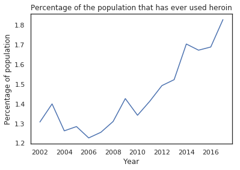
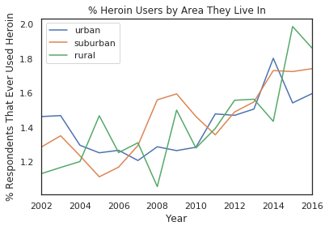
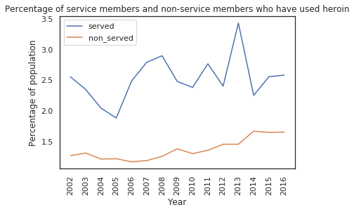
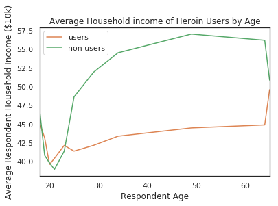
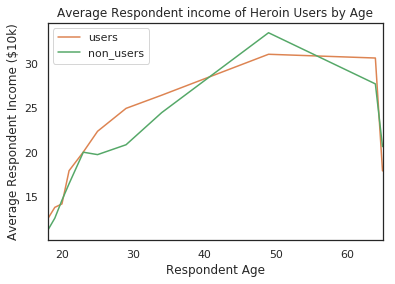
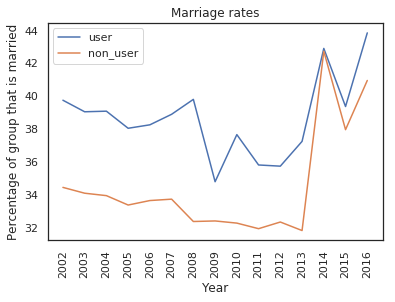
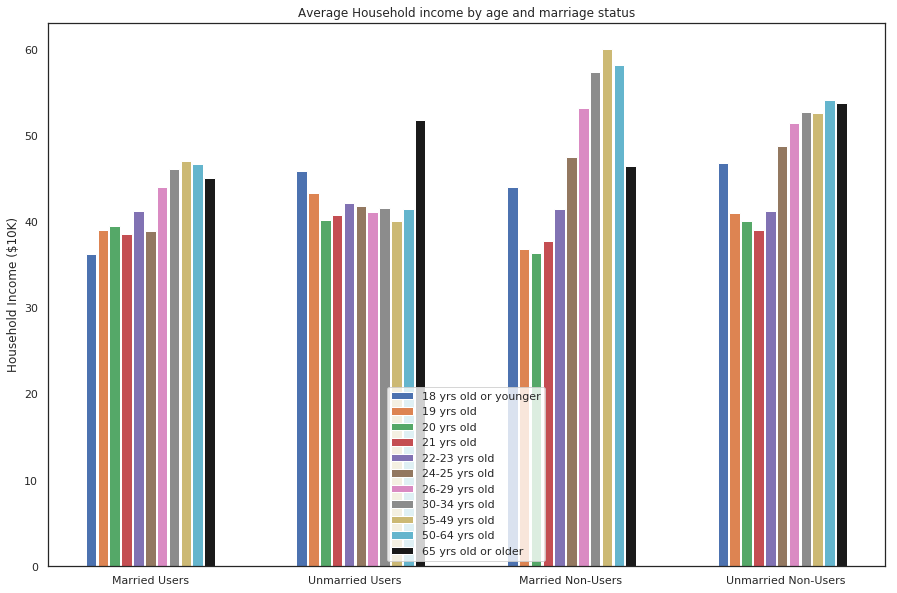

# The Opioid Epidemic & Its Socioeconomic Effects
### By Daniel Connolly & Bryce Mann

We sought to investigate various differences between people who have used opioids, specifically heroin, and the people who do not. We utilized data from the National Survey of Drug Use and Health to perform several experiments regarding the use of opioids in the United States. To comply with the NSDUH guidelines, we will not share the raw data, but will instead share our findings in the form of various statistics and plots.

## Experiment 1: Characterizing the Epidemic

While it is often assumed that opioid use has reached epidemic levels, we first tested this idea for ourselves. To do so, we measured the percentage of respondents who had ever used heroin.

As we can see, the percentage of respondents that have ever used heroin has increased by approximately 0.5 percentage points between 2002 and 2016, an effect size of +40%. If we assume the respondents perfectly represent the 325 million people in the US, this increase means that 1.625 million more people had ever used heroin as of 2016 as compared to 2002. According to the CDC, an “epidemic refers to an increase, often sudden, in the number of cases of a disease above what is normally expected in that population in that area.” Over the course of 14 years, an increase of 1.625 million people would seem to confirm that heroin use has reached epidemic levels.

To further confirm that the increase in the use of opioids is not simply a function of drug use as a whole increasing, we also looked into the use of crack, lsd, and pain relievers for non-medical purposes. Over the same period as heroin, or 2002 to 2016, crack use has declined by 13% and lsd use has declined by 23%. Additionally, the nonmedical use of pain relievers has declined by 6%. For more specific information and plots regarding these other drugs, you can refer to our jupyter notebook. These effect sizes indicate that an epidemic is unique to the use of heroin, as even the use of pain relievers has declined.

We next wanted to understand when in people’s lifetimes they began to use opioids. As a result, we plotted the average age at which respondents said they began using heroin, or pain relievers, over the years.

Between 2002 and 2016, the average age at which people first used heroin increased by 2.5 years, and the average age people started using painkillers increased by 2 years. The increase is due to so-called “late-starters,” which is consistent with the common narrative that opioids have begun to impact older people through new and different pathways.

We checked the way heroin has impacted different communities as well. By separating our data into those that live in urban, suburban, and rural areas, we were able to see that while heroin use has increased across all groups (urban, suburban, and rural), it has had notably different effects on each. For instance, we can see that rural heroin use has increased the most, while urban use has increased the least. This is also fairly consistent with the idea that opioid use is affecting people through new pathways.

Finally, we looked into the differences in heroin use between those who had served in the military and those who had not.

As this plot elucidates, the percentage of each population that uses heroin is much higher amongst those who have served in the military than those who have not, with effect sizes of over +100% for many of the years reported. This confirmed our expectation that drug use would be higher in the military than the rest of the population.  

## Experiment 2: Socioeconomic Effects

After establishing that heroin use has been increasing since 2002, we sought to compare the socioeconomic status of users and non-users to see what effect using heroin might have on people’s earning potential. After grouping respondents by whether they have used heroin or not, we visualized their average household income as a function of respondent age.

After getting out of the early 20s, the household earnings of users and non-users diverge dramatically. Between the ages of 25 and 64, people who have used heroin live in households that make between $7,500-$12,000 less than people who don’t use: this is an effect size between -14% and -22% less. Additionally, we calculated that for this area of deviation the p-values between the average household incomes of users and non-users are all <.001, making it highly unlikely this discrepancy is caused by random chance.

After seeing these effects, our first thought was that the individual respondents incomes would show a similar deviation, but surprisingly this turned out not to be the case.

The personal incomes of the users and non-users actually follow each other pretty closely. Since these track each other, it could suggest the difference in household incomes is due to non-heroin users getting married at higher rates.

We explored that possibility but again, somewhat surprisingly, that turned out not to be the case; heroin users are consistently more likely to be married for most of the years in the data set, with the last few years being the only times the percentages converge. From 2002-2013 there is an absolute difference of between 4%-7% of users being married as opposed to non-users, making them married 13%-22% more often than non users.

Finally, we looked at the household incomes of users and non-users, but also grouped the respondents by marital status so that we could hopefully figure out where the big difference between household incomes was coming from.

Here we can see more of a difference that we would expect to see between the groups; across the board the non-users live in wealthier households, but there is a stark difference between many of the using and non-using age groups that have the same marital status, especially as the age of the respondent gets higher. In fact, the income of the married users, while it increases, is not nearly as steep of an increase as the non-users. For the unmarried people, users seem to have a pretty flat average income. Their income does not really change as they age, while unmarried non-users see a sharp increase as they age. This seems to suggest that non-users in general have a higher potential to earn as they age and that those non-users who get married end up with higher earning spouses than people who use.
