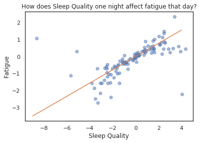
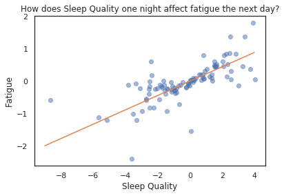
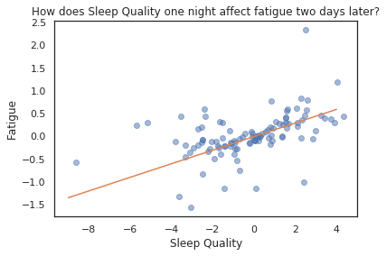

# Datafest: Measuring Fatigue and Its Effects in Womens Rugby 7s
#### Daniel Connolly and Bryce Mann

We investigate womens' rugby 7s data provided by the Canadian national team, including looking into how fatigue and sleep affect wins and losses, delayed onset muscle soreness, and whether potential hits predict soreness, fatigue, and other measures of personal wellness. To comply with 2019 Datafest challenge guidelines, from which we received the data, we do not share the raw data and will keep the findings of our analysis private until May 4. Although we explore an immense number of relationships between wellness, effort, and game data, we present here only the most meaningful of our tests. For more information, you can read [this Jupyter notebook](proposal2.md).

### Methodology
The DataFest challenge provides four csv files of data. These four files contain:
* Game data, such as scores, outcomes, and opponents.
* GPS data recorded during games at 100 Hz and provided to us at 10 Hz.
* Wellness data, such as fatigue, soreness, and pain, collected each morning before 8:30am during the season.
* Rate of Perceived Exertion data, such as type of training session, duration of session and rate of perceived exertion, collected after each activity throughout the season.

After every workout or activity, the athletes were asked to rate how much they exerted themselves on a scale of 0-10. In order to ensure these numbers accurately reflect the players’ levels of exertion, we standardize this data by player by subtracting the mean and dividing by the standard deviation of the individual’s scores throughout the season. Similarly, we standardize each player’s wellness scores, such as fatigue and irritability, which were collected each morning, in order to ensure no single player is skewing the data with unusually low or high average ratings.

Additionally, we investigate the effects of workouts and sleep over the course of several days. To accomplish this, we add columns to our pandas dataframes that contain each player’s wellness ratings on a given day, the next day, and sometimes even two to three days later. Based on this data, we look into delayed onset muscle soreness and other questions.

### Predicting Game Outcome and Scoring
Our first exploration is to see whether the players’ morning wellness scores impacted the outcomes of their games (W or L, encoded as 1 and 0 respectively), the amount of points their team scored, and the amount of points they gave up. To give us an initial idea of what type of relationships these variables have with each other we looked at the correlation matrix that contains all of these values.

There is a lot of information here, some of it looking promising. Since all of the wellness scores were originally scored from 1-7, with 1 being the worst, the fact that these wellness Z-scores are positively correlated with the game outcomes and the points scored and are all negatively correlated with points allowed are good signs. This suggests that the better players are feeling on the mornings of their games they are more likely to win and score more points, while giving up fewer points. This leads us to run multiple regression on each of these three situations to see if any of these independent variables could have predictive power.

First we run a logistic regression model, with the game outcome being the dependent variable and the wellness data being independent: the results of this regression can be seen below.

Unfortunately there doesn’t seem to be much here. The psuedo R-squared value is low meaning the model is not great at predicting the dependent variable and none of the independent variables seem to have much significance, with all of their p-values well above the established threshold of .5. It is the same story when we try to isolate small subsets of the independent variables or single ones: nothing seems to be significant or very useful in predicting whether games will be won or lost.

Next we look deeper into the points scored and allowed in each game. We ran multiple regression models on each of these situations; both of these results can be seen below.

 

### Delayed Onset Muscle Soreness

  

### Potential Hits as a Predictor of Wellness
