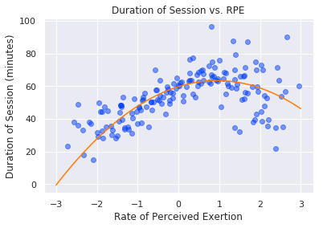

# Health Metrics in Womens Rugby 7s
#### Daniel Connolly and Bryce Mann

We investigate womens' rugby 7s data provided by the Canadian national team, including looking into how fatigue and sleep affect wins and losses, delayed onset muscle soreness, and whether potential hits predict soreness, fatigue, and other measures of personal wellness. To comply with 2019 Datafest challenge guidelines, from which we received the data, we do not share the raw data and will keep the findings of our analysis private until May 4. Although we explore an immense number of relationships between wellness, effort, and game data, we present here only the most meaningful of our tests. For more information, you can read [this Jupyter notebook](proposal2.md).

### Methodology
The DataFest challenge provides four csv files of data. These four files contain:
* Game data, such as scores, outcomes, and opponents.
* GPS data recorded during games at 100 Hz and provided to us at 10 Hz.
* Wellness data, such as fatigue, soreness, and pain, collected each morning before 8:30am during the season.
* Rate of Perceived Exertion data, such as type of training session, duration of session and rate of perceived exertion, collected after each activity throughout the season.

After every workout or activity, the athletes were asked to rate how much they exerted themselves on a scale of 0-10. In order to ensure these numbers accurately reflect the players’ levels of exertion, we standardize this data by player by subtracting the mean and dividing by the standard deviation of the individual’s scores throughout the season. Similarly, we standardize each player’s wellness scores, such as fatigue and irritability, which were collected each morning, in order to ensure no single player is skewing the data with unusually low or high average ratings.

Additionally, we investigate the effects of workouts and sleep over the course of several days. To accomplish this, we add columns to our pandas dataframes that contain each player’s wellness ratings on a given day, the next day, and sometimes even two to three days later. Based on this data, we look into delayed onset muscle soreness and other questions.

### Predicting Game Outcome and Scoring
Our first exploration is to see whether the players’ morning wellness scores impacted the outcomes of their games (W or L, encoded as 1 and 0 respectively), the amount of points their team scored, and the amount of points they gave up. To give us an initial idea of what type of relationships these variables have with each other we looked at the correlation matrix that contains all of these values.

There is a lot of information here, some of it looking promising. Since all of the wellness scores were originally scored from 1-7, with 1 being the worst, the fact that these wellness Z-scores are positively correlated with the game outcomes and the points scored and are all negatively correlated with points allowed are good signs. This suggests that the better players are feeling on the mornings of their games they are more likely to win and score more points, while giving up fewer points. This leads us to run multiple regression on each of these three situations to see if any of these independent variables could have predictive power.

First we run a logistic regression model, with the game outcome being the dependent variable and the wellness data being independent: the results of this regression can be seen below.

Unfortunately there doesn’t seem to be much here. The psuedo R-squared value is low meaning the model is not great at predicting the dependent variable and none of the independent variables seem to have much significance, with all of their p-values well above the established threshold of .5. It is the same story when we try to isolate small subsets of the independent variables or single ones: nothing seems to be significant or very useful in predicting whether games will be won or lost.

Next we look deeper into the points scored and allowed in each game. We ran multiple regression models on each of these situations; both of these results can be seen below.

 

These models have R-squared values about two and three times higher than before, but they still aren’t high enough to be considered a good predictor of the points scored for and against each team. We also see one significant variable in the PointsScored model, where SleepQuality has a very low p-value, suggesting that the effect sleep quality has on the teams’ points is not due to random variation. This turned out to not lead anywhere though, as we isolated it by itself and with other subsets of the dependent variables only to find it become either not significant anymore or lower the R-squared values, neither of which are useful to us in trying to predict anything about the teams’ games.

### Delayed Onset Muscle Soreness
As it is often anecdotally supported, we sought to investigate the validity of delayed onset muscle soreness, or DOMS, which is the pain and stiffness supposedly felt in muscles most often two days after a workout. With our dataset organized to allow for looking at the next day's data, we first look into how sleep quality affects fatigue. From our understanding of DOMS, we expect that one day after (i.e. one sleep cycle removed) experiencing a poor night's sleep, the athletes will report being the most fatigued. Note that in the plots below, the most negative numbers mean the athlete is exhausted, while the most positive numbers represent feeling fresher than usual; similarly, lower numbers indicate more restless sleep, while higher numbers indicate deep and restfull sleep.

  

As the plots show, sleep quality appears to affect perceived fatigue most the day immediately following the poor sleep (p=0.000, r^2=0.204). With each successive day, the slope of the line linearly regressed to the data decreased, suggesting the impact on fatigue of the sleep quality on a given night decreases with each successive day.

Given that rugby is a definitively contact-heavy sport, we also explore whether the number of potential hits or tackles a player experiences impacts their future wellness. Based on our initial exploration of the data, including plotting the players’ movements throughout games and the accelerations they experienced, we defined a potential hit as when the absolute value of their total acceleration in all three directions was greater than 5.8 meters per second squared.

At this point, we look at how well the number of potential hits predicts wellness data over the course of the three days after the hits take place. Of all of the data available to us, the only wellness factor whose dependence on potential hits had a statistically significant pvalue (p=0.000) and r-squared (r^2=0.115) was soreness two days after the hits occurred. One day after the hits, with soreness as the dependent value, the pvalue was 0.022, but the r-squared value was low, at just 0.031. Three days after the hits, the pvalue for soreness' dependence on potential hits was 0.000 and the r-squared value had decreased to 0.104 from 0.115 two days after the hits. In the plot below, not that -3 represents the highest degree of soreness and 3 the lowest degree of soreness.

As the plot above shows, as the number of potential hits increases, the players tend to experience the effects of DOMS more and more strongly two days later. This suggests that the theory of delayed onset muscle soreness has statistical validity to it.

### Wellness Effects

Here we try to see whether the RPE (or rate of perceived exertion) that the athletes felt after they trained or played could be a predictor of their wellness scores the next morning. Our initial exploration is to look at the correlation matrix that contains all of these values, which can be seen below.

None of these correlations are particularly high, but it is at least promising to see that all of them are negatively correlated: since the most exerted someone can report is a 10, as the exertion increases we expect to see the wellness scores decrease the next day, which is what the matrix suggested. With this data we ran single regression on each variable with RPE as the independent variable, but unfortunately these results did not tell us anything interesting. All of the coefficient signs were negative, which is what we expected, and even though RPE is significant when trying to predict Fatigue, Soreness and Desire, none of these models have an R-squared value greater than .046. The predictive power of these models is not good at all: this is evident by looking at the data corresponding to one of these relationships (which is what they all look like).

In order to try and improve our model of RPE predicting wellness scores for the next day we try to run single regression on each variable, but with the RPE scores sorted by the type of training session they correspond to. We hope that this will allow us to see different types of training having an effect on players wellness, since the exertion that players report could be of very different types depending on what kind of exercise they were doing. We split the RPE dataframe up by training session type and run single regression on each variable, with the RPEs of that training type being the independent variables. We then save any result that was significant or a better predictor than we have seen so far (p<.05 or r^2>.1). The relevant results these models produce are below.

Unfortunately, none of these results were saved because they were predictive; the highest R-squared is only .08. These were all flagged as significant variables, but their usefulness is limited because of their lack of predictive power. That being said it is good to see that the signs of the coefficients make sense, at a cursory level at least. All of the training types have negative effects on wellness scores the next day, which makes sense as hard workouts can cause people to be tired, sore, and generally not feeling their best the next day. Interestingly, the only positive coefficient is when RPE tries to predict players’ Desire the day after games; this makes sense as well, as after putting a lot of effort into a competition people can feel more inspired and driven to improve for the next one.

The final path we go down in this line of questioning is taking the previous model and trying to incorporate the session duration into the model as well as the reported RPE for each given session type. This ended up not being an fruitful avenue though, as no basic combinations of duration and RPE make a meaningful difference in the model’s ability to predict wellness scores.

We did, however, find a slightly interesting relationship between session duration and reported RPE by themselves. It appears that the rate of perceived exertion has a parabolic relationship with the duration of each training session. With a p-value of 0.000 and an effect size of 0.106, this relationship is certainly statistically significant. It appears to show that the athletes perceive the longest sessions as requiring an average amount of exertion, while the easiest and most difficult session tend to be shorter.

Finally, we look at the relationship between several categorical variables such as nutrition, illness, and menstruation and the number of potential hits a player experiences in a game that day. Of the variables into which we look, menstruation is definitively the most interesting, as it appears that menstruation tends to lead players to be involved in more hits or tackles during games.

