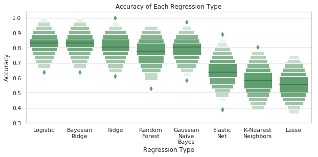

# Tried and True: Regression Models sometimes beat Neural Networks
#### Daniel Connolly

Machine learning is a tool that is often talked about as a sort of black box which we can only peek into with great difficulty. Because the increasing complexity of models is only exacerbating this issue, I found it worthwhile to see how traditional regression models of machine learning measured up to more complicated neural networks. In particular, I investigate heart disease in [my notebook](https://github.com/djconnolly27/DataScienceProjects/blob/master/project3/project3.ipynb) using data provided by a [DrivenData competition](https://www.drivendata.org/competitions/54/machine-learning-with-a-heart/) called Machine Learning with a Heart in order to find how a variety of machine learning models measure up to one another in this specific instance. The data, however, originates with the UCI Machine Learning Repository's [Statlog heart dataset](http://archive.ics.uci.edu/ml/datasets/Statlog+%28Heart%29). In accordance with the repository's citation policy, I have linked to the page where I found the data. The dataset contains 13 explanatory variables ranging from the results of a thallium stress test to age, all of which are to be used in order to predict whether or not a person has heart disease.

#### Neural Network
I create a neural network that relies on the relu activation function in order to predict whether or not a person has heart disease. After a variety of tests with the activation functions like tanh and sigmoid, I manually determine that relu performs best in these circumstances, as the other activation functions lead to repeated overfitting of the training data. Additionally, I limit the number of layers in the neural network to five, with the number of neurons halving in each successive hidden layer, starting at 64 neurons and skipping 2 neurons (i.e. 64,32,16,4,1). With more than five hidden layers, overfitting again becomes a problem and the simulations quickly become too computationally expensive (for my laptop) to be worthwhile. Throughout the network, I use binary-crossentropy as a loss function in accordance with the DrivenData competition's use of a log-loss function, as these two functions are effectively equivalent here.

 

As the plots above demonstrate, the model performs fairly well at its best. It achieves an accuracy as high as 82% and a loss close to 0.5. However, averaging out its performs over the course of many epochs, it tends to under-perform the training data significantly.

#### Regression Models

In order to determine the best regression model against which to compare the neural network, I run through a variety of eight different regression models, simulating 1000 trials with each model. I also employ data shuffling and choose an 80/20 train/test split, as the dataset is small and thus requires a higher percentage of the data be allocated to training than usual. Ultimately, the plot below highlights the differences in performance between the regression models in this instance. Lasso regression, for instance, proves ineffective and able to predict whether or not a person has heart disease at a rate only slightly above a fair coin flip. The best models, logistic regression and bayesian ridge regression, perform quite well in comparison, each with a mean accuracy above 82%.

###### Conclusions and Future Work

Comparing the  two models, it appears that the best regression models consistently outperform the neural network on this dataset. While the neural network manages to perform well initially, rising to 82% accuracy its peak, it quickly begins to overfit. In contrast, the mere mean accuracy logistic regression and bayesian ridge models is slightly higher than this mark. As a result, it is quite clear that the regression models significantly outperformed the neural network on this dataset.

In terms of future work, I believe the neural network can still be significantly improved such that it is nearly competitive with the regression models. I began work on the neural network late in the project, and thus was unable to dedicate quite as much time to its development as it deserved. Specifically, I believe that more automated hyperparameter tuning would be key to improvements in the performance of the neural network. Moreover, in my notebook, I spend a great deal of time investigating possible nonlinear relationships between variables in the dataset; this work could easily be built upon in future work. One could also choose to more specifically focus on minimizing the log-loss of the models in order to score higher in the DrivenData competition or more broadly on heart disease, bringing in domain knowledge to improve the models.
